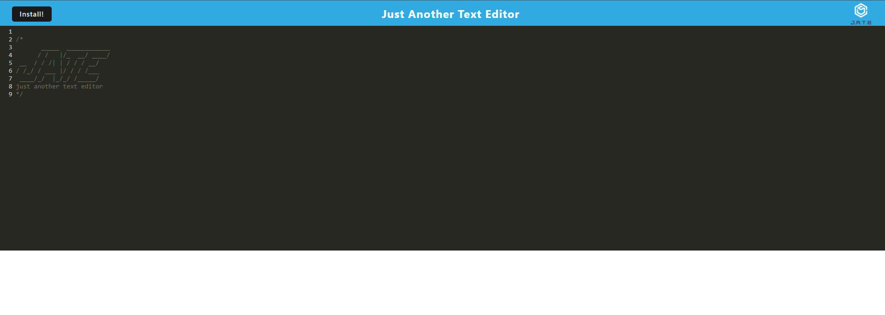

# Text Editor

## Description

This application is a Text Editor web application that meets the PWA (Progressive Web Application) criteria including being installable, can be used on multiple browsers and screens, and network independence. This application features a number of data persistence techniques such as saving to and loading from localStorage, and utilising IndexedDB database that is present in all modern web browsers that serve as redundancy in case either one of the options is not supported by the browser. The application also functions offline.

The application is deployed in Heroku.

## Website

Visit [this](https://rugged-shenandoah-88884.herokuapp.com/) to see the application in action.

## Demo

The following images shows the web application's appearance and functionality:




## Installation

After forking the project, run the code below to install the modules needed to run this program:

```
npm install
```

## Usage

To run the program, run the code below:

```
npm start
```

This will create the bundled up version of the application under `/client/dist` folder. Right-click on the `index.html` file and select `Open with Live Server`.
